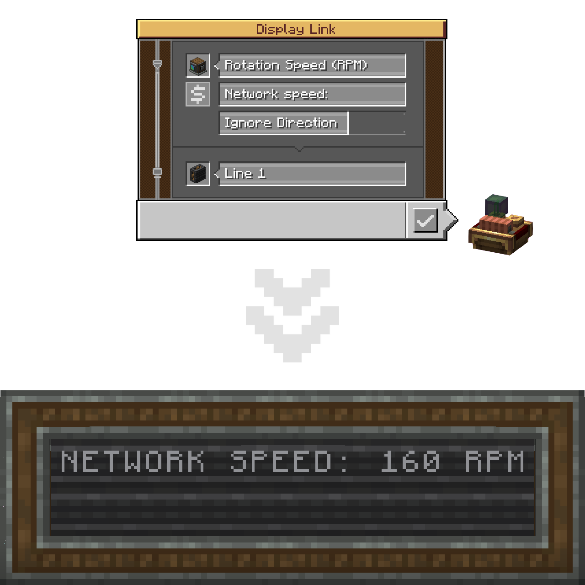
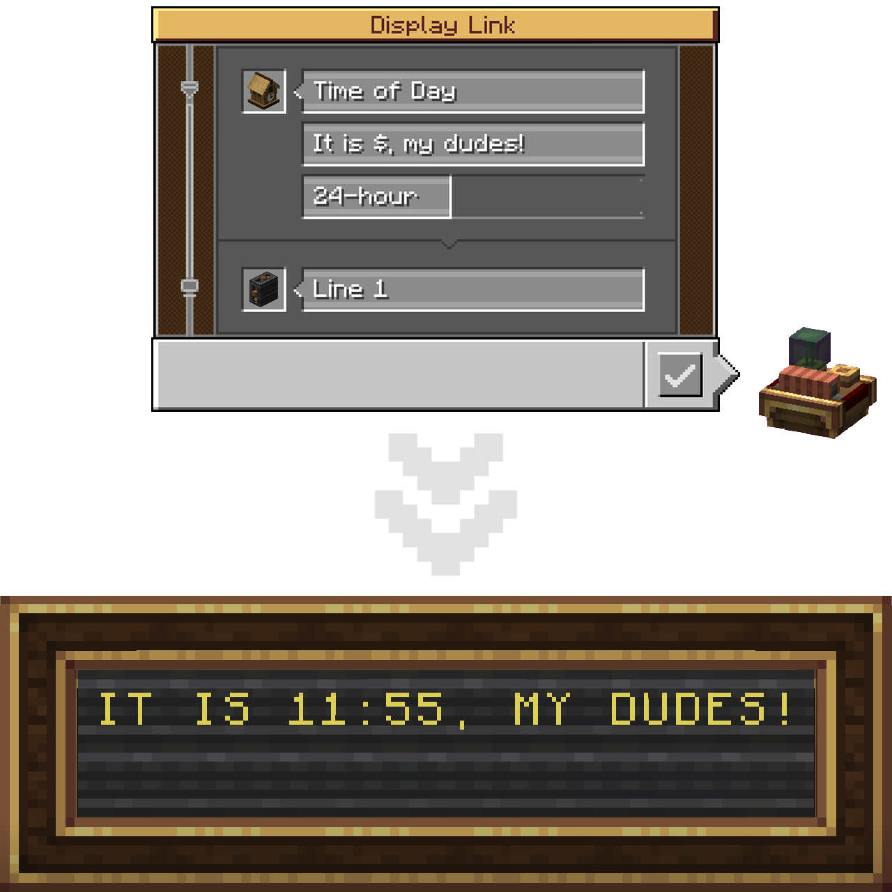
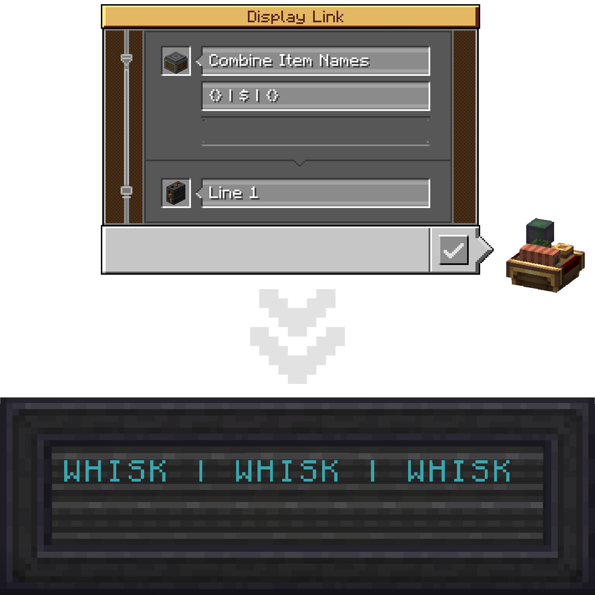
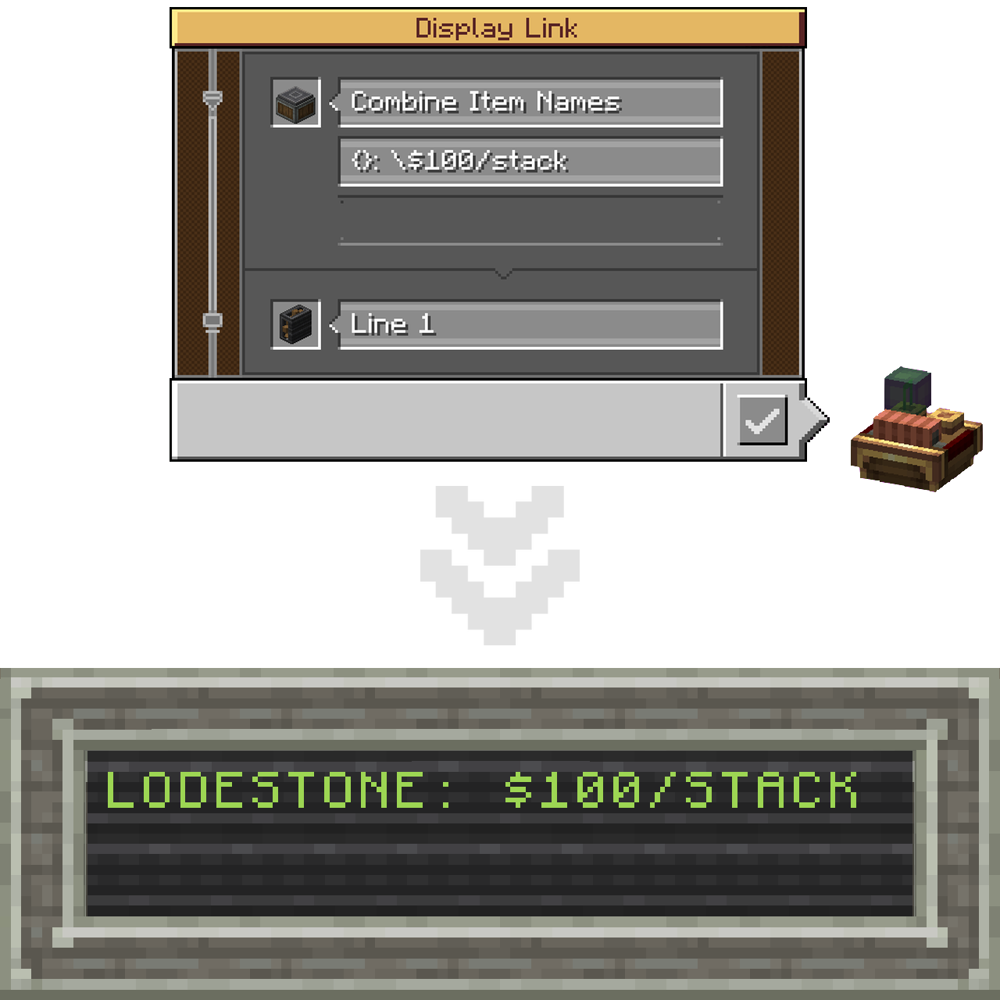
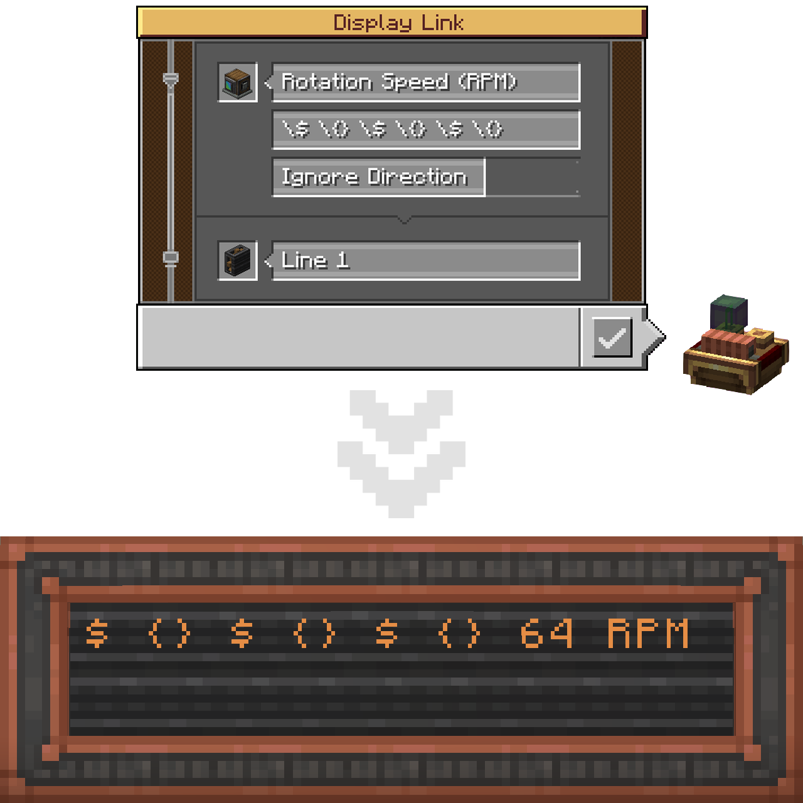
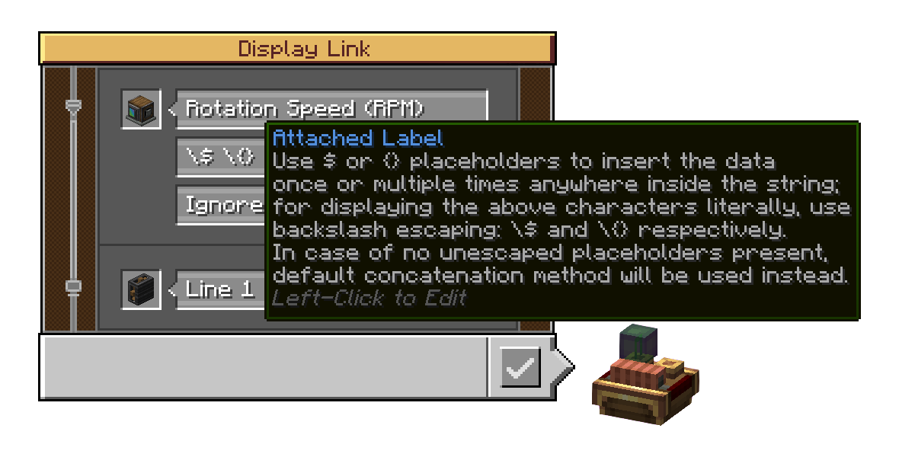

  
  <h1>Create: Improved Display Link Experience</h1>
	
	

___
## Create: Improved Display Link Experience (C: IDLX) is a little Quality-of-Life add-on for Create mod aimed at sprucing up some of Display Link features, mainly the underrated Attached Label option.

---

    <h2>Currently added features</h2>
1. Placeholders for the Attached Label.
    
###### Yeah, that's basically it for now.

---
## 1. Placeholders for the Attached Label:
The way Create mod currently handles displaying information (aka data) with the attached label is by simply concatenating them with a space:
It's a simple way, but thus a severely limiting one in terms of customization.

[Collapsible]

This add-on pushes the boundaries apart by introducing the `$` and `{}` placeholders (aka specifiers).
Placing one (or more) marks the place where the information string should be inserted.
In short, the Attached Label can now act like a formatted string!

[Collapsible]

You can utilize as many placeholders as you want in one string. Mixing both types of them doesn't cause any issues as well!

[Collapsible]

If you need to insert a `$` character literally (same applies to `{}`), without it turning into a placeholder, use backslash-escaping on it.

[Collapsible]

In case of no unescaped placeholders present in the label altogether, default (base Create's) concatenation will be applied.

[Collapsible]

Lastly, there's a new tooltip linked to the Attached Label input field, that briefly repeats the above.

[Collapsible]

---
# The README is incomplete and will be getting updates through further development.